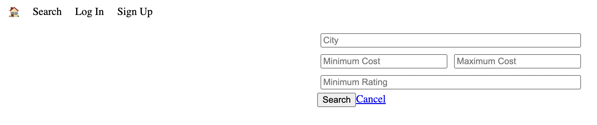

# Light House BnB Project

LightHouseBnB is a property rental service similar to AirBnB.

In this repository, I was able to develop back-end skills creating and designing an ERD for the database in Postgres, and implementing it to interact with Node backend so the necessary information is displayed on the Web Page.

## Getting Started
1. Clone this repository onto your local device.
2. Install dependencies using the `npm install` command.
3. Start the web server using the `npm run local` command from the folder LightBnB_WebApp-master. The app will be served at <http://localhost:3000/>.
4. Go to <http://localhost:3000/> in your browser.

## Dependencies
- Express
- Node 5.10.x or above
- Postgres
- Bcrypt
- Body parser
- Cookie session

## How to use it
- The user can visualize all the properties available to rent on the Home section.
- There is the option to login and check your own reservations as well as your properties.
- Additionally, you filter the results by city, minimum and maximum price and rating for the property you are looking for.

## Examples

